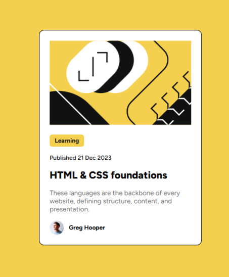
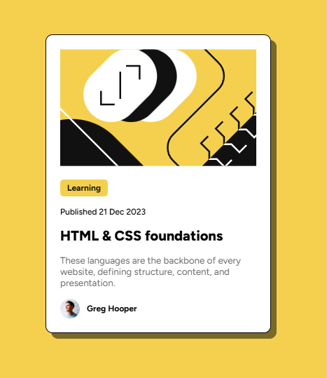

# Frontend Mentor - Blog preview card solution

This is a solution to the [Blog preview card challenge on Frontend Mentor](https://www.frontendmentor.io/challenges/blog-preview-card-ckPaj01IcS). Frontend Mentor challenges help you improve your coding skills by building realistic projects. 

## Table of contents

- [Frontend Mentor - Blog preview card solution](#frontend-mentor---blog-preview-card-solution)
  - [Table of contents](#table-of-contents)
  - [Overview](#overview)
    - [The challenge](#the-challenge)
    - [Screenshot](#screenshot)
    - [Links](#links)
  - [My process](#my-process)
    - [Built with](#built-with)
    - [What I learned](#what-i-learned)
    - [Continued development](#continued-development)
    - [Useful resources](#useful-resources)
    - [AI Collaboration](#ai-collaboration)
  - [Author](#author)


## Overview

### The challenge

Users should be able to:

- See hover and focus states for all interactive elements on the page

### Screenshot



### Links

- Solution URL: [Add solution URL here](https://your-solution-url.com)
- Live Site URL: [Add live site URL here](https://your-live-site-url.com)

## My process

### Built with

- Semantic HTML5 markup
- CSS custom properties
- Flexbox
- CSS Grid
- CSS animation

### What I learned

The hovering effect with the shadow

Using animation for replicate the feeling of levitating. 

```css
.blog-preview-card {
      display: flex;
      flex-flow: column;
      width: 320px;
      background-color: hsl(0, 0%, 100%);
      border-radius: 10px;
      gap: 15px;
      font-family: Figtree;
      border: 1px solid black; 

      /* shadow */
      box-shadow: 0px 0px rgb(0, 0, 0, 0);
      transition: box-shadow 0.4s ease-in;

      /* animation*/
      animation: 
        500ms ease-in-out 0ms forwards descend;
    }

    .blog-preview-card:hover{
      animation: 
        500ms ease-in-out 0ms forwards hover-up;
      box-shadow: 8px 8px rgb(0, 0, 0, 0.5);
    }

    @keyframes hover-up{
      from{
        transform: translate(0px,0px);
      }

      to{
        transform: translate(-8px,-8px);
      }
    }

    @keyframes descend{
      from{
        transform: translate(-8px,-8px);
      }

      to{
        transform: translate(0px,0px);
      }
    }  
```

### Continued development

Make this personalised to myself.

### Useful resources

- [MDN Animation](https://developer.mozilla.org/en-US/docs/Web/CSS/Guides/Animations/Using) - This helped me for referring to what is required to animation.
- [MDN transition](https://developer.mozilla.org/en-US/docs/Web/CSS/Reference/Properties/transition) - This helped with the fading for the box-shadow
- [Animate box-shadow](https://tobiasahlin.com/blog/how-to-animate-box-shadow/) - This also helped me with the box-shadow

### AI Collaboration

AI on google search was used.

## Author

- Github - [yoranguy](https://github.com/yoranguy)


